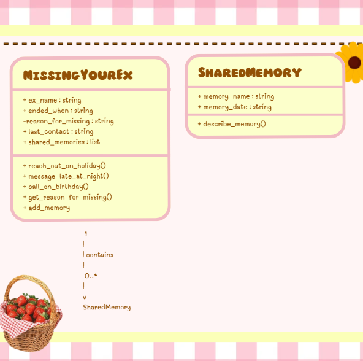
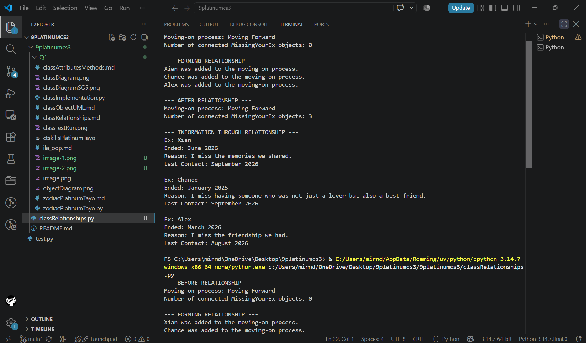
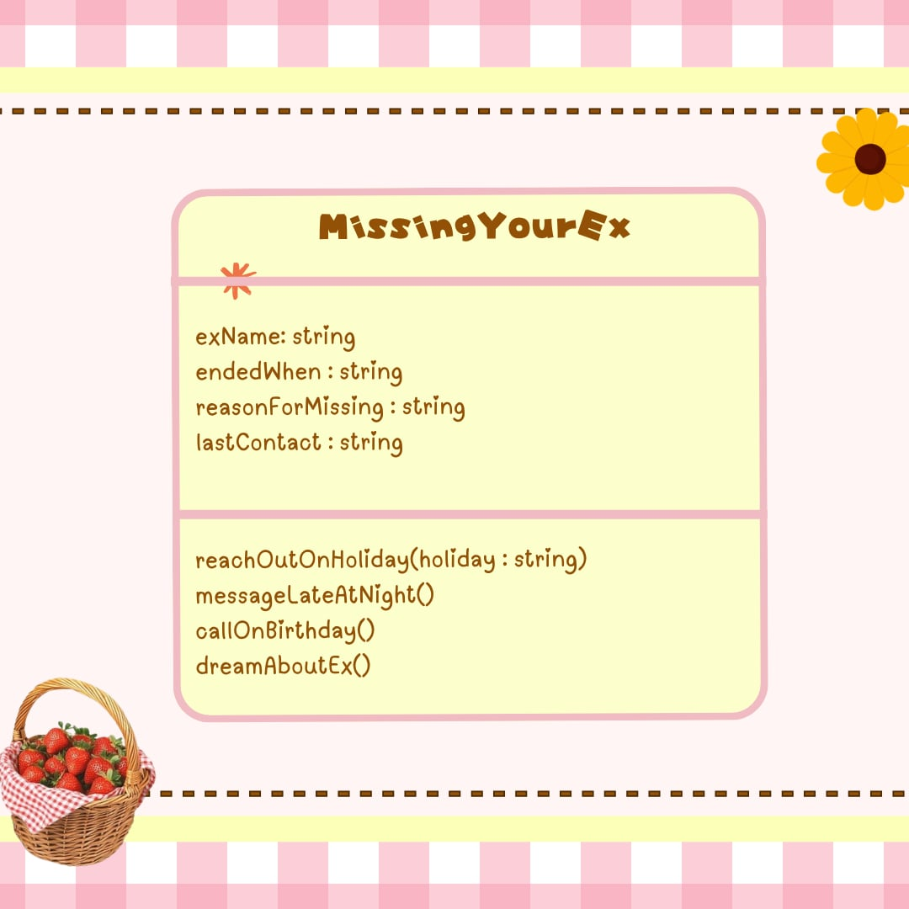

# Class Attributes and Methods

## Previous Design

Link to my previous activity:

[classObjectUML.md](classObjectUML.md)

## Design Revision

Changes from my previous design:
- I kept the same `MissingYourEx` class and the same four properties from my previous design.
- I changed the property names to `snake_case` so they follow Python naming conventions.
- I made `reason_for_missing` private because it represents personal information that should not be directly changed by other parts of the program.
- I added `get_reason_for_missing()` to safely access the private attribute.
- I kept the original methods but made them perform actual actions that can change the object's `last_contact` attribute.

## Visibility Decisions

| Attribute | Data Type | Visibility | Reason |
|---|---|---|---|
| ex_name | string | Public | The ex's name can be accessed normally because other parts of the program may need to identify the ex. |
| ended_when | string | Public | The time when the relationship ended can be accessed normally. |
| reason_for_missing | string | Private | This information is internal to the object and should be protected from direct changes. |
| last_contact | string | Public | The last contact needs to be accessed and updated when an action is performed. |

## Updated UML Class Diagram

## Python Implementation

[View Python Source](classImplementation.py)

## Test Run

 

## Object Diagram

 

## Analysis

### Why did you make your chosen attribute private?

I made `reason_for_missing` private because it is an internal part of the object that should not be changed directly by other parts of the program. If other parts of the program could change it freely, the information could accidentally be replaced with something incorrect or unrelated. Making it private helps protect the data and keeps control of it inside the class. I can still access its value through the `get_reason_for_missing()` method.

### Which method changes the state of your object?

The `reach_out_on_holiday()` method changes the state of my object. It changes the `last_contact` attribute based on the holiday given as its parameter. For Object 1, calling `reach_out_on_holiday("Christmas")` changes the last contact from `"December 2025"` to `"Contacted on Christmas"`. This shows how a method can change the state of an object.

### How did your two objects demonstrate that instances are independent?

My two objects were created from the same `MissingYourEx` class, but they have different values. When I called `reach_out_on_holiday("Christmas")` on Object 1, only Object 1's `last_contact` changed. Object 2 kept its original `last_contact` value of `"November 2025"`. This proves that each object has its own separate state even though they came from the same class.

### What is the difference between your class diagram and your object diagram?

The class diagram shows the blueprint of my `MissingYourEx` class, including its attributes, data types, visibility, and methods. The object diagram shows the actual objects created from that class and their specific values after the method was executed. For example, the class diagram shows `last_contact : string`, while the object diagram shows `"Contacted on Christmas"` for Object 1. The class diagram shows what objects can contain, while the object diagram shows what the objects actually contain.